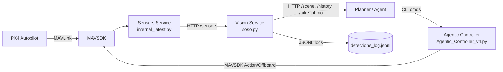

# PX4 Agent (Sensors + Vision + Controller)

A modular stack for on‑board sensing, visual perception, and MAVSDK‑based control. This README explains each service, how they work together, how to run them, example outputs, and what to build next.

---

## System Overview



- **Sensors Service** (`internal_latest.py`): subscribes to PX4 telemetry via MAVSDK; publishes a live JSON snapshot at `GET /sensors` and a console summary.
- **Vision Service** (`soso.py`): runs object detection (Ultralytics YOLO if available), fuses detections with `/sensors` GPS + yaw, and serves:
  - `GET /scene` (last 5 s)
  - `GET /history` (previous 5 s in a 10 s window)
  - `GET /take_photo` (saves the last frame)
- **Agentic Controller** (`Agentic_Controller_v4.py`): a MAVSDK controller with a CLI (takeoff/land/orbit/goto/yaw/move/look_*).

> Boot order: **Sensors → Vision → Controller/Planner**.

---

## Quickstart

### 1) Sensors Service (PX4 → JSON)

Run the telemetry web service on port 8001:

```bash
python internal_latest.py --url udp://:14540 --hz 1.0 --json mavsdk_sensor_snapshot.json --host 0.0.0.0 --port 8001
```

- **Output 1 — Console**: prints battery %, GPS fix, position, velocity, attitude, health, RC, heading, wind.
- **Output 2 — HTTP**: `GET http://127.0.0.1:8001/sensors` returns a JSON snapshot, e.g.

```json
{
  "timestamp": "2025-09-17T19:22:53+00:00",
  "battery": { "voltage_v": 16.2, "remaining": 100.0 },
  "gps": { "num_satellites": 10, "fix_type": "FIX_3D" },
  "position": { "lat_deg": 47.3968183, "lon_deg": 8.5497142, "abs_alt_m": 3.8910, "rel_alt_m": 0.0610 },
  "velocity_ned": { "north_m_s": 0.02, "east_m_s": -0.01, "down_m_s": -0.13 },
  "attitude": { "euler_deg": { "roll_deg": 178.45, "pitch_deg": -1.70, "yaw_deg": 128.32 } },
  "health": { "local_position_ok": true, "global_position_ok": true, "home_position_ok": true },
  "status": { "armed": false, "flight_mode": "HOLD", "in_air": false }
}
```

> Tip: The JSON is simultaneously written to `--json` path for other processes.

### 2) Vision Service (Detections + Geo‑projection)

Start the perception server on port 8088 (it will poll `/sensors` to fuse GPS/yaw):

```bash
python soso.py --port 8088  # adjust flags to your camera/model if present
```

**Endpoints**
- `GET /scene` → most recent 5 seconds of detections + global state header
- `GET /history` → the older 5 seconds (from a 10 s rolling window)
- `GET /take_photo` → saves the latest frame (RGB) and returns the file name

**Example outputs from your run (Sep 17, 2025):**

- `GET /take_photo`:

```json
{ "status": "success", "file": "photo_20250917_152019.jpg" }
```

- `GET /scene`:

```json
{
  "global": {
    "timestamp": "2025-09-17T19:19:54+00:00",
    "gps": { "lat": 47.3968178, "lon": 8.5497142, "alt": 4.1760 },
    "yaw_deg": 129.33,
    "window_sec": 5
  },
  "count": 3,
  "summary_by_object": { "car": 3 },
  "detections": [
    {
      "Object Name": "car",
      "Time": "15:19:53.33",
      "Center": { "x_m": 3.19, "y_m": -0.49, "z_m": 7.13 },
      "Confidence": 0.85,
      "estimated_global": { "lat": 47.3967545, "lon": 8.5497609, "alt": 3.708 }
    }
  ]
}
```

- `GET /history`:

```json
{
  "global": {
    "timestamp": "2025-09-17T19:19:58+00:00",
    "gps": { "lat": 47.3968176, "lon": 8.5497150, "alt": 4.1650 },
    "yaw_deg": 129.51,
    "window_sec": 5
  },
  "count": 5,
  "summary_by_object": { "car": 5 },
  "detections": [
    {
      "Object Name": "car",
      "Time": "15:19:54.35",
      "Center": { "x_m": 3.19, "y_m": -0.49, "z_m": 7.13 },
      "Confidence": 0.85,
      "estimated_global": { "lat": 47.3967547, "lon": 8.5497606, "alt": 3.686 }
    }
  ]
}
```

> Coordinate frame used by the vision service (for relative detections): `x` right, `y` up, `z` forward. These are rotated into ENU using drone yaw, then approximated to lat/lon offsets.

### 3) Agentic Controller (Interactive CLI)

Launch the controller REPL:

```bash
python Agentic_Controller_v4.py
```

**Common commands**

```text
status            # print armed/in_air/mode/lat-lon/alt/battery/GPS fix
arm               # auto-connect and arm (takeoff also auto-arms)

takeoff 3         # take off to 3 m AGL (default if omitted)
forward 2         # move forward 2 m (body frame)
yaw_left 90       # rotate left 90°

orbit 5 cw 1.5    # 5 m radius, CW, integrates true 360° and snaps back
orbit 5 ccw 1.0 return  # CCW, then return to the center after orbit

goto <lat> <lon> [abs_alt_m]
land | rtl | stop
look_down 90 | look_forward
exit
```

---

## Data Contracts

### `/sensors` (Sensors Service → Vision/Planner)
Minimal fields used by perception:

```jsonc
{
  "position": { "lat_deg": <float>, "lon_deg": <float>, "abs_alt_m": <float>, "rel_alt_m": <float> },
  "attitude": { "euler_deg": { "yaw_deg": <float> } },
  "gps": { "num_satellites": <int>, "fix_type": "FIX_3D|..." },
  "status": { "armed": <bool>, "in_air": <bool> }
}
```

### `/scene` and `/history` (Vision → Planner)

```jsonc
{
  "global": { "timestamp": <iso>, "gps": { "lat": <f>, "lon": <f>, "alt": <f> }, "yaw_deg": <f>, "window_sec": <int> },
  "count": <int>,
  "summary_by_object": { "car": 3, ... },
  "detections": [
    {
      "Object Name": "car",
      "Center": { "x_m": <f>, "y_m": <f>, "z_m": <f> },
      "Confidence": <0..1>,
      "estimated_global": { "lat": <f>, "lon": <f>, "alt": <f> }
    }
  ]
}
```

### Photos
- `GET /take_photo` → `{ "status": "success", "file": "photo_YYYYMMDD_HHMMSS.jpg" }`

---

## Example Agent Loop (Planner)

```python
import requests, time

# 1) Query current scene
scene = requests.get("http://127.0.0.1:8088/scene", timeout=0.5).json()

# 2) Select a target class and pick the most confident detection
targets = [d for d in scene.get("detections", []) if d.get("Object Name") == "car"]
if not targets:
    print("No cars right now; try again.")
else:
    det = max(targets, key=lambda d: d.get("Confidence", 0))
    tgt = det.get("estimated_global")
    if tgt:
        lat, lon = tgt["lat"], tgt["lon"]
        # 3) In the controller REPL: goto lat lon, then orbit for inspection
        print(f"Target at {lat:.6f},{lon:.6f}")
        print("In controller: goto <lat> <lon> [alt]; orbit 8 cw 1.0 return; look_down 90; /take_photo")
```

---

## What’s Working Well

- **Robust telemetry**: clean snapshot API and conservative subscription rates, with graceful error handling.
- **Vision/Geo fusion**: fuses per‑frame detections with latest GPS + yaw; provides windowed `scene` and `history` views; supports headless photo capture.
- **Controller UX**: high‑level primitives (`goto`, `orbit`, `look_*`, body‑frame moves) and self‑guarded flows (auto‑connect, offboard start/stop, settle‑hold).

---

## Gaps & Next Steps (High Impact)

1) **Coordinate Frames & Calibration**  
   - Confirm camera → body alignment; today we assume `x` right, `y` up, `z` forward. Add a YAML for extrinsics and rotate detections accordingly.  
   - Replace spherical‑earth degree math with ENU via GeographicLib/pyproj for accurate metre→lat/lon conversion at any latitude.  

2) **Quality Gates & Uncertainty**  
   - Gate `estimated_global` when GPS fix < 3D or sats < N, or yaw age > threshold.  
   - Add covariance (e.g., pixel→metre scaling uncertainty) to each estimated_global to help planners choose safer behaviors.  

3) **Tracking & ID**  
   - Add simple byte‑track or IoU tracker to maintain object IDs across frames; produce velocity estimates in world frame (smoother orbits & better re‑acquire).  

4) **Time Sync**  
   - Include monotonic timestamps for camera frames and sensor snapshots; assert Δt within a small bound when fusing.  

5) **APIs for Autonomy**  
   - Add `/best_target?class=car` (returns top detection with a TTL) and `/goto_object?id=...` to reduce planner glue code.  
   - Expose `/health` endpoints for both services; include last error, last frame age, and rate.

6) **Safety & Failsafes**  
   - In the controller, refuse `goto/orbit` if `FixType` < 3D or if `in_air` is false.  
   - Add geofence radius and minimum alt checks before `orbit`/`goto`.  

7) **Dev Experience**  
   - Add Dockerfiles and a `docker-compose.yml` (px4‑sitl, sensors, vision).  
   - Provide a small synthetic stream for CI to test `/scene` without hardware.

---

## Troubleshooting

- **`/sensors` is empty or slow**: confirm MAVSDK URL (`udp://:14540`), PX4 heartbeat, and that rates are being set. Ensure port 8001 is free.
- **No detections**: verify camera index/path; if Ultralytics not installed, it falls back; ensure model weights are available or use HOG mode.
- **`/take_photo` returns error**: only works when a frame has been displayed; headless mode must still update `latest_frame_for_photo`.
- **Orbit drifts**: wind or small yaw integration error; the controller already snaps back to the perimeter start point — reduce speed or radius and ensure GPS is stable.

---

## Repository Layout

```
internal_latest.py          # Sensors Service (FastAPI on :8001)
soso.py                     # Vision Service + HTTP on :8088 (scene/history/take_photo)
Agentic_Controller_v4.py    # MAVSDK Controller CLI (takeoff/goto/orbit/look_*)
```

---

## License

MIT (or your preferred license).
